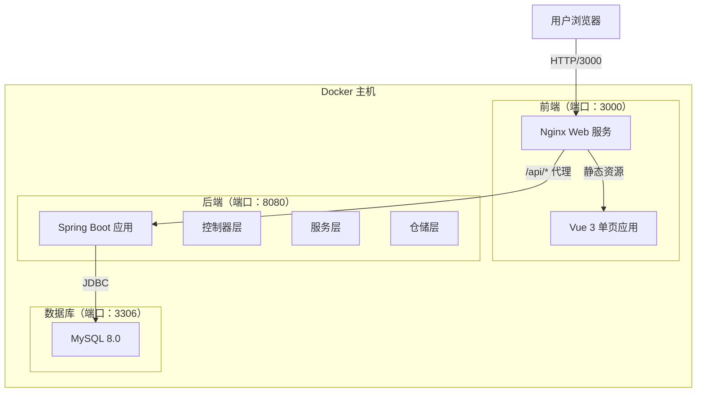

# Sky-Lark 系统架构文档

## 1. 系统概览

Sky-Lark 是一个现代化的企业级全栈应用框架，旨在提供高性能、可扩展且易于维护的基础设施。系统采用经典的前后端分离架构，通过 RESTful API 进行通信，并完全基于 Docker 容器化部署。

## 2. 技术栈

### 2.1 前端
- **框架**：Vue 3（Composition API）
- **构建工具**：Vite 5.x
- **UI 组件库**：Element Plus
- **样式方案**：Tailwind CSS 3.x
- **状态管理**：Pinia
- **路由**：Vue Router 4.x
- **HTTP 客户端**：Axios

### 2.2 后端
- **框架**：Spring Boot 3.2.x（Java 17）
- **ORM**：Spring Data JPA（Hibernate）
- **数据库驱动**：MySQL Connector/J
- **构建工具**：Maven 3.9.11
- **通用组件**：Lombok、Slf4j

### 2.3 数据存储
- **数据库**：MySQL 8.0
- **连接池**：HikariCP（Spring Boot 默认）

### 2.4 基础设施
- **容器化**：Docker 与 Docker Compose
- **Web 服务**：Nginx（前端静态资源与反向代理）

## 3. 架构设计

### 3.1 容器架构图



### 3.2 数据流向

1. **用户请求**：用户通过浏览器访问 `http://localhost:3000`。
2. **Nginx 处理**：前端容器内的 Nginx 接收请求。
   - 静态资源请求直接返回 Vue 构建产物。
   - `/api/*` 请求被反向代理到后端容器 `http://backend:8080`。
3. **后端处理**：Spring Boot 接收 API 请求。
   - 控制器层解析请求参数。
   - 服务层处理业务逻辑。
   - 仓储层通过 JPA 与数据库交互。
4. **数据库交互**：MySQL 执行 SQL 查询并返回结果。
5. **响应返回**：数据经由后端 → Nginx → 浏览器，最终由 Vue 渲染展示。

### 3.3 界面层结构

前端界面主要由布局层、状态展示层、数据展示层组成：

- **布局层**：顶部导航 + 页面主体 + 页脚，统一间距与响应式断点。
- **状态展示层**：三张状态卡片分别展示前端、后端、数据库状态与更新时间。
- **数据展示层**：数据表格展示核心字段，并提供刷新操作与加载反馈。
- **交互反馈**：请求中展示加载状态，请求失败显示错误提示。

## 4. 目录结构说明

```
sky-lark/
├── backend/                 # 后端项目根目录
│   ├── src/main/java/       # Java 源代码
│   ├── src/main/resources/  # 配置文件与 SQL 脚本
│   ├── Dockerfile           # 后端构建镜像定义
│   └── pom.xml              # Maven 依赖管理
├── frontend/                # 前端项目根目录
│   ├── src/                 # Vue 源代码
│   ├── public/              # 静态资源
│   ├── Dockerfile           # 前端构建镜像定义
│   ├── nginx.conf           # Nginx 配置文件
│   └── vite.config.js       # Vite 构建配置
├── docs/                    # 项目文档
├── docker-compose.yml       # 容器编排文件
└── README.md                # 项目入口文档
```
